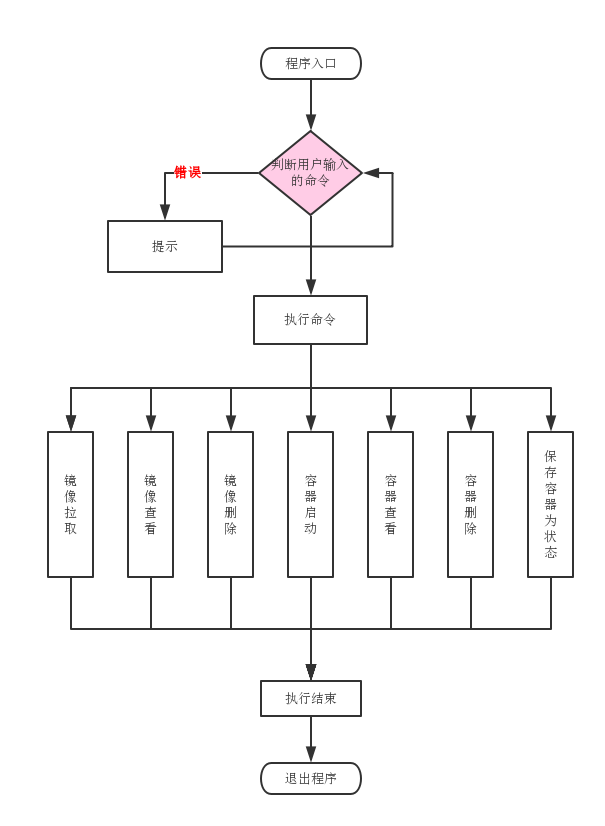

# 一个简单的docker项目源码分析

[TOC]

> [bocker](https://github.com/hellolijj/bocker) 项目, 使用上百行的代码就实现了一个简易的docker。可以实现 镜像拉取，镜像查看，容器启动，容器删除，容器查看，容器资源限制，镜像删除等功能。是一个非常不错的入门级容器学习项目。

项目地址：https://github.com/hellolijj/bocker

### 项目流程

从入口处判断用户输入的命令并对命令的合法性进行判断，根据不同的命令执行不同的函数，实现不同的功能。项目流程图如下：
 

### 程序入口

```
[[ -z "${1-}" ]] && bocker_help "$0"
    # @1 执行与help
case $1 in
    pull|init|rm|images|ps|run|exec|logs|commit|cleanup) bocker_"$1" "${@:2}" ;;
    *) bocker_help "$0" ;;
esac
```

程序入口，逻辑相当于是我们程序里面的main函数，根据传入的参数执行不同的函数

### help 函数

```
function bocker_help() { #HELP Display this message:\nBOCKER help
	sed -n "s/^.*#HELP\\s//p;" < "$1" | sed "s/\\\\n/\n\t/g;s/$/\n/;s!BOCKER!${1/!/\\!}!g"
}
```
帮助函数，如果在入口处函数输入错误，可以通过 help 函数查看命令用法

### 镜像拉取

这里使用了 docker registry api v2版本。代码流程是首先是auth，获取对应镜像对应权限的进行一个token，然后利用token获取到镜像的每一个layer，这里 jq json解析插件，会比较方便的操作Jason，转为shell相关变量，然后下载所有的layer转存到自己的唯一镜像目录中，同时保存一个镜像名为一个文件。
```
function bocker_pull() {
    token=$(curl "https://auth.docker.io/token?service=registry.docker.io&scope=repository:library/$1:pull"  | jq '.token'| sed 's/\"//g')
    registry_base='https://registry-1.docker.io/v2'
    tmp_uuid="$(uuidgen)" && mkdir /tmp/"$tmp_uuid"

    # @2 获取docker镜像每一层的layter,保存到数组中
    manifest=$(curl -sL -H "Authorization: Bearer $token" "$registry_base/library/$1/manifests/$2" | jq -r '.fsLayers' | jq -r '.[].blobSum' )
    [[ "${#manifest[@]}" -lt 1 ]] && echo "No image named '$1:$2' exists" && exit 1

    # @3 依次获取镜像每一层, 然后init
    for id in ${manifest[@]}; do
        curl -#L -H "Authorization: Bearer $token" "$registry_base/library/$1/blobs/$id" -o /tmp/"$tmp_uuid"/layer.tar
        tar xf /tmp/"$tmp_uuid"/layer.tar -C /tmp/"$tmp_uuid"
    done
    echo "$1:$2" > /tmp/"$tmp_uuid"/img.source
    bocker_init /tmp/"$tmp_uuid" && rm -rf /tmp/"$tmp_uuid"
}
```

### 镜像保存

镜像layer下载了之后，然后创建目录，再保存为本地存储的 btrfs 文件结构。镜像名称为 img_42001 ~ img_42254 随机生成名称。

```
function bocker_init() { 
	uuid="img_$(shuf -i 42002-42254 -n 1)"
	if [[ -d "$1" ]]; then
		[[ "$(bocker_check "$uuid")" == 0 ]] && bocker_run "$@"
		btrfs subvolume create "$btrfs_path/$uuid" > /dev/null
		cp -rf --reflink=auto "$1"/* "$btrfs_path/$uuid" > /dev/null
		[[ ! -f "$btrfs_path/$uuid"/img.source ]] && echo "$1" > "$btrfs_path/$uuid"/img.source
		echo "Created: $uuid"
	else
		echo "No directory named '$1' exists"
	fi
}
```

### 镜像删除

镜像删除，首先解除 btrfs 文件与本地文件的绑定，随后删除在本地挂载的文件夹。
```
function bocker_rm() { #HELP Delete an image or container:\nBOCKER rm <image_id or container_id>
	[[ "$(bocker_check "$1")" == 1 ]] && echo "No container named '$1' exists" && exit 1
	btrfs subvolume delete "$btrfs_path/$1" > /dev/null
	cgdelete -g "$cgroups:/$1" &> /dev/null || true
	echo "Removed: $1"
}
```

### 容器启动

容器启动时是这个项目最核心的内容。

第一步：生成一个唯一的id 作为 container_id
第二步：通过ip link && ip netns 实现隔离的网络namespace与网络通信
第三步：更改nameserver, 保存cmd
第四步：通过cgroup-tools工具配置cgroup资源组与调整资源限制
第五步：执行 网络命名空间的切换，操纵文件的chroot，文件挂载，将运行的日志记录写入文件

```
function bocker_run() { 
    # @1 环境准备,生成唯一id,检查相关镜像,ip, mac地址
    uuid="ps_$(shuf -i 42002-42254 -n 1)"
    [[ "$(bocker_check "$1")" == 1 ]] && echo "No image named '$1' exists" && exit 1
    [[ "$(bocker_check "$uuid")" == 0 ]] && echo "UUID conflict, retrying..." && bocker_run "$@" && return
    cmd="${@:2}" && ip="$(echo "${uuid: -3}" | sed 's/0//g')" && mac="${uuid: -3:1}:${uuid: -2}"

    # @2 通过ip link && ip netns 实现隔离的网络namespace与网络通信
    ip link add dev veth0_"$uuid" type veth peer name veth1_"$uuid"
    ip link set dev veth0_"$uuid" up
    ip link set veth0_"$uuid" master bridge0
    ip netns add netns_"$uuid"
    ip link set veth1_"$uuid" netns netns_"$uuid"
    ip netns exec netns_"$uuid" ip link set dev lo up
    ip netns exec netns_"$uuid" ip link set veth1_"$uuid" address 02:42:ac:11:00"$mac"
    ip netns exec netns_"$uuid" ip addr add 10.0.0."$ip"/24 dev veth1_"$uuid"
    ip netns exec netns_"$uuid" ip link set dev veth1_"$uuid" up
    ip netns exec netns_"$uuid" ip route add default via 10.0.0.1
    btrfs subvolume snapshot "$btrfs_path/$1" "$btrfs_path/$uuid" > /dev/null

	# @3 更改nameserver, 保存cmd
    echo 'nameserver 8.8.8.8' > "$btrfs_path/$uuid"/etc/resolv.conf
    echo "$cmd" > "$btrfs_path/$uuid/$uuid.cmd"

    # @4 通过cgroup-tools工具配置cgroup资源组与调整资源限制
    cgcreate -g "$cgroups:/$uuid"
    : "${BOCKER_CPU_SHARE:=512}" && cgset -r cpu.shares="$BOCKER_CPU_SHARE" "$uuid"
    : "${BOCKER_MEM_LIMIT:=512}" && cgset -r memory.limit_in_bytes="$((BOCKER_MEM_LIMIT * 1000000))" "$uuid"

    # @5 执行
    cgexec -g "$cgroups:$uuid" \
        ip netns exec netns_"$uuid" \
        unshare -fmuip --mount-proc \
        chroot "$btrfs_path/$uuid" \
        /bin/sh -c "/bin/mount -t proc proc /proc && $cmd" \
        2>&1 | tee "$btrfs_path/$uuid/$uuid.log" || true
    ip link del dev veth0_"$uuid"
    ip netns del netns_"$uuid"
```

### 查看日志

查看日志，就是将日志文件的内容输入到终端
```
function bocker_logs() {
    # @1 查看日志
    [[ "$(bocker_check "$1")" == 1 ]] && echo "No container named '$1' exists" && exit 1
    cat "$btrfs_path/$1/$1.log"
}
```
### 进入容器内部

进入容器内部
第一步：获取容器运行内存的pid
第二步：切换当前pid 命名空间 并切换操作文件目录

```
function bocker_exec() { #HELP Execute a command in a running container:\nBOCKER exec <container_id> <command>
	[[ "$(bocker_check "$1")" == 1 ]] && echo "No container named '$1' exists" && exit 1
	cid="$(ps o ppid,pid | grep "^$(ps o pid,cmd | grep -E "^\ *[0-9]+ unshare.*$1" | awk '{print $1}')" | awk '{print $2}')"
	[[ ! "$cid" =~ ^\ *[0-9]+$ ]] && echo "Container '$1' exists but is not running" && exit 1
	nsenter -t "$cid" -m -u -i -n -p chroot "$btrfs_path/$1" "${@:2}"
}
```

## 总结

这个项目利用了shell的优势，实现了一部分docker的主要功能，但是还有很多的功能没有实现，比如跨主机通信，端口转发，端口映射，异常处理等等，不过作为学习的项目来说，还是可以让人了解docker 实现的基本原理。

