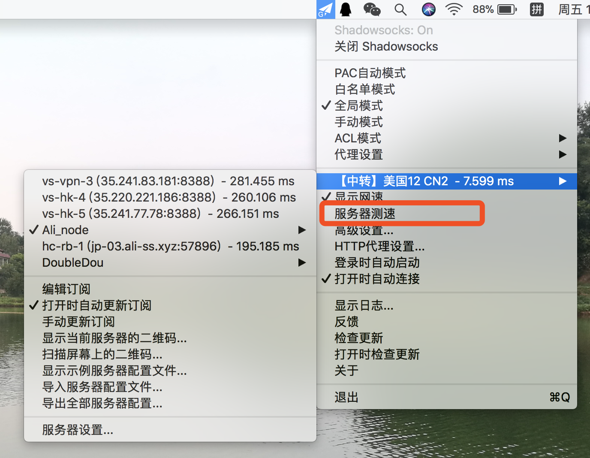
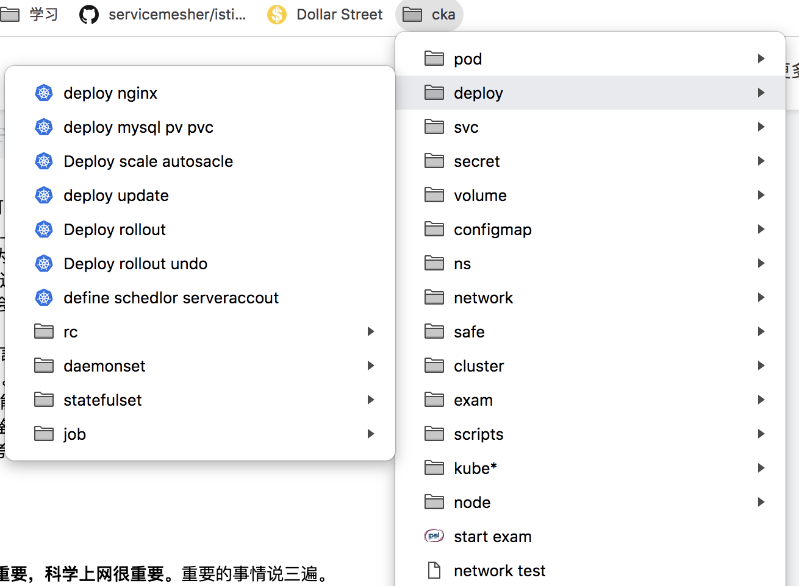
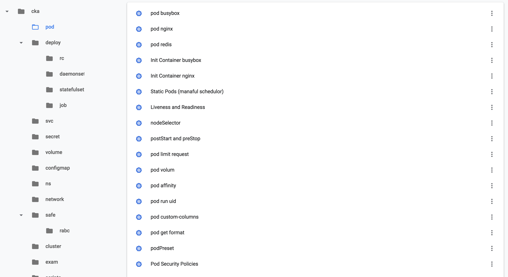

# cka 考试资料梳理 

>  cka 的全称 criticate kubernetes administrator 。考出了个证，只能说明你了解 kubernetes 的基本架构及操作。总的来说，对于 入门云计算，学习 kubernetes 的人来说，一个不错的自我证明机会。

[toc]

考完经验分享： https://ottodeng.io/post/cka-exam/
考试大纲及F&Q： https://github.com/hackstoic/kubernetes_practice/blob/master/%E5%85%B3%E4%BA%8EK8S%E7%9B%B8%E5%85%B3%E8%AE%A4%E8%AF%81%E7%9A%84%E8%AF%B4%E6%98%8E.md

cka 考试总结： https://www.cnadn.net/post/2647.htm

cka 学习资料链接汇总： https://github.com/hackstoic/kubernetes_practice/blob/master/%E5%8F%82%E8%80%83%E8%B5%84%E6%96%99.md

### 考试练习环境

可以使用 如下的方法 搭建一个考试练习环境。
https://github.com/arush-sal/cka-practice-environment

### 考试学习资料
华为讲课视频资料（免费）
https://bbs.huaweicloud.com/forum/thread-11064-1-1.html

### cka exam pre

cka 考试练习题（没有答案）
https://docs.google.com/document/d/1AMVwvVabPoYt-o1k8Uo7UlmlfsjQKVHDhDyKP3QqbOM/edit

### 关于翻墙网速的方法

考试过程，网络的环境是至关重要的。这里推荐几个关于网络环境的小技巧。

- 使用mac的同学，有线连接的环境要比无线连接好。
- 早晨时候的网络环境要比白天、晚上的环境好。笔者的第二次考试是在凌晨3点考的。
- 使用多个翻墙切入点是十分有必要的。然后通过ss测试，选出最好的一个网络
- 

### 关于考试身份验证的问题

- cka 考试要求使用 带有英文名字的国家签订的 有效证件。如果有 `护照` 使用护照是可以的。但是笔者没有护照，使用的 `身份证 + 学校在读证明`。因为在读证明有名字的 英文翻译。
- 如果遇到其他问题，也可以根据 考试 手册里提供的邮箱，发邮件确认身份验证是否可行。

### 关于考试小技巧

- 为了快速的在官网里查到 yaml 文件，所以在考试前。建立收藏夹并分类是十分有必要的。笔者 将官网刷了好几遍，对其中的 yaml 文件进行了分类。所以考试期间，查官网资料，几乎是一次性就找到的。
- 
- 
- 
- 由于考试时间比较紧张。一般的 执行完 `kubectl create -f [yaml]` 文件后，需要花十几秒时间才能看到创建的资源。因此，创建后资源后，直接做下一个题目。回头通过 `kubectl get []` 命令查看资源创建结果。

### 关于考试的练习题目

题目来源：

https://blog.spider.im/2018/06/26/cka-exam/