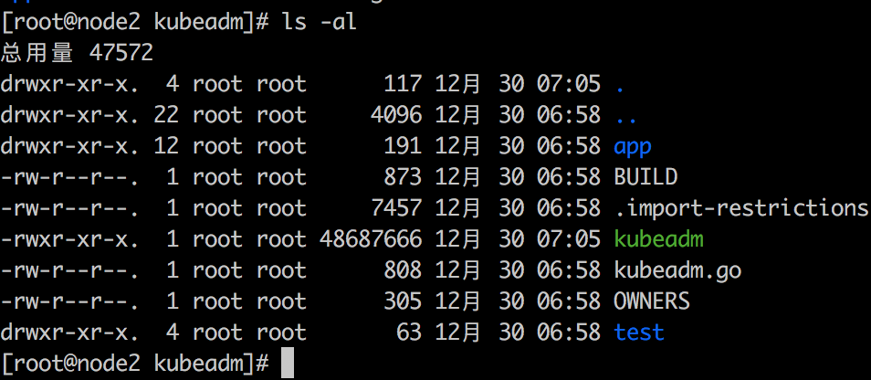
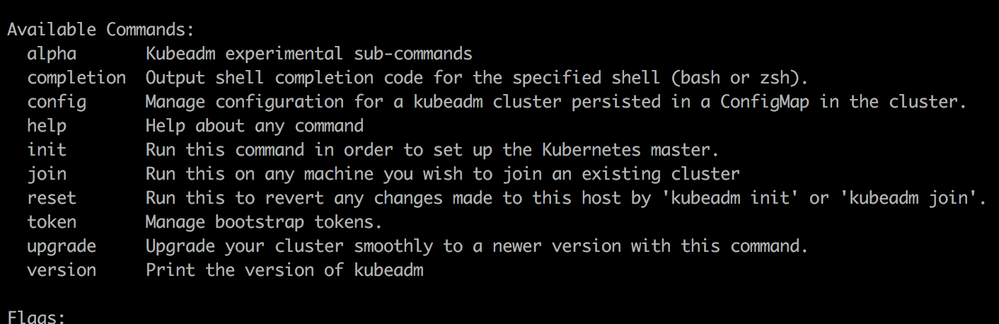
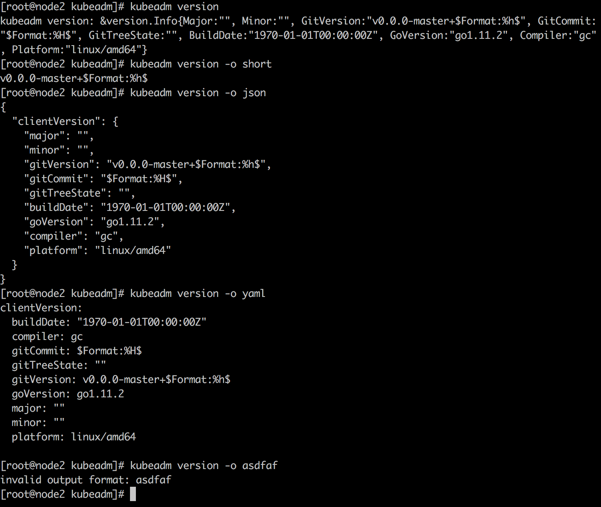

# kubeadm 源码分析

> kubeadm 可以帮助 大多数初级使用者快速的搭建出一个 用于学习的 kubernetes 环境。但是 kubeadm 在搭建 kuberntes 环境中 到底做了哪些工作呢？使用 kubeadm 搭建出来的环境跟真实的线上 kuberentes 环境有哪些不同点呢？这些都需要从源码中找到答案。
> 
> 由于kubenetes 的代码一直在不停的更新中，本文将 kubernetes 代码 fork 到本人账号下，创建 kubeadm-anlysis 分支： 用于与源码对应起来：https://github.com/hellolijj/kubernetes/tree/kubeadm-analysis

[toc]

### kubeadm 工具的build 生成

操作部分：
```
# 1、切换到项目目录
$ cd ./cmd/kubeadm

# 2、编译生成 kubeadm 二进制文件
$ go build

# 3、将生成的二进制文件 移动到 `/usr/bin` 可执行目录下
```



#### 项目的入口 [kubeadm/kubeadm.go#L27](https://github.com/kubernetes/kubernetes/blob/master/cmd/kubeadm/kubeadm.go#L27-L34)

```
func main() {
	klog.InitFlags(nil)
	if err := app.Run(); err != nil {
		fmt.Fprintf(os.Stderr, "error: %v\n", err)
		os.Exit(1)
	}
	os.Exit(0)
}
```

`klog.InitFlags()` 函数 用于初始化 `klog` 包，后续可使用 klog 记录日志。 		`klog` 包来自于 `k8s.io/klog`，而 `k8s.io/klog` 来自于 `golang/glog`。

#### app.Run

`app.Run()`  函数，在 [kubeadm/app/kubeadm.go#L31](https://github.com/hellolijj/kubernetes/blob/kubeadm-analysis/cmd/kubeadm/app/kubeadm.go#L31-L49) 处声明。

```
func Run() error {
	pflag.CommandLine.SetNormalizeFunc(utilflag.WordSepNormalizeFunc)
	pflag.CommandLine.AddGoFlagSet(flag.CommandLine)

	pflag.Set("logtostderr", "true")
	// We do not want these flags to show up in --help
	// These MarkHidden calls must be after the lines above
	pflag.CommandLine.MarkHidden("version")
	pflag.CommandLine.MarkHidden("log-flush-frequency")
	pflag.CommandLine.MarkHidden("alsologtostderr")
	pflag.CommandLine.MarkHidden("log-backtrace-at")
	pflag.CommandLine.MarkHidden("log-dir")
	pflag.CommandLine.MarkHidden("logtostderr")
	pflag.CommandLine.MarkHidden("stderrthreshold")
	pflag.CommandLine.MarkHidden("vmodule")

	cmd := cmd.NewKubeadmCommand(os.Stdin, os.Stdout, os.Stderr)
	return cmd.Execute()
}
```

#### NewKubeadmCommand()

`Run()` 函数声明 一些 flag 参数。 最后调用 `cmd.NewKubeadmCommand()` 函数。而该函数在 [kubeadm/app/cmd.go#L33-L79](https://github.com/kubernetes/kubernetes/blob/master/cmd/kubeadm/app/cmd/cmd.go#L33) 处声明。

```
cmds.AddCommand(NewCmdCompletion(out, ""))
cmds.AddCommand(NewCmdConfig(out))
cmds.AddCommand(NewCmdInit(out))
cmds.AddCommand(NewCmdJoin(out))
cmds.AddCommand(NewCmdReset(in, out))
cmds.AddCommand(NewCmdVersion(out))
cmds.AddCommand(NewCmdToken(out, err))
cmds.AddCommand(upgrade.NewCmdUpgrade(out))
cmds.AddCommand(alpha.NewCmdAlpha(in, out))

AddKubeadmOtherFlags(cmds.PersistentFlags(), &rootfsPath)
return cmds
```
在这里 kubeadm 后面接的参数依次进入不同的函数。eg:
kubeadm completion
kubeadm config
kubeadm init
kubeadm join
kubeadm reset
kubeadm version
等等

#### cmd.Execute()

最终 cmd.Execute() 执行 命令

### 小试牛刀： kubeadm version 命令熟悉 go 语言

执行 `kubeadm version` 命令，进入到 	`./kubeadm/app/cmd/version.go#L40` 文件。

```
func NewCmdVersion(out io.Writer) *cobra.Command {
	cmd := &cobra.Command{
		Use:   "version",
		Short: "Print the version of kubeadm",
		Run: func(cmd *cobra.Command, args []string) {
			err := RunVersion(out, cmd)
			kubeadmutil.CheckErr(err)
		},
	}
	cmd.Flags().StringP("output", "o", "", "Output format; available options are 'yaml', 'json' and 'short'")
	return cmd
}

func RunVersion(out io.Writer, cmd *cobra.Command) error {
	klog.V(1).Infoln("[version] retrieving version info")
	clientVersion := version.Get()
	v := Version{
		ClientVersion: &clientVersion,
	}

	const flag = "output"
	of, err := cmd.Flags().GetString(flag)
	if err != nil {
		klog.Fatalf("error accessing flag %s for command %s: %v", flag, cmd.Name(), err)
	}

	switch of {
	case "":
		fmt.Fprintf(out, "kubeadm version: %#v\n", v.ClientVersion)
	case "short":
		fmt.Fprintf(out, "%s\n", v.ClientVersion.GitVersion)
	case "yaml":
		y, err := yaml.Marshal(&v)
		if err != nil {
			return err
		}
		fmt.Fprintln(out, string(y))
	case "json":
		y, err := json.MarshalIndent(&v, "", "  ")
		if err != nil {
			return err
		}
		fmt.Fprintln(out, string(y))
	default:
		return errors.Errorf("invalid output format: %s", of)
	}

	return nil
}
```
在  `NewCmdVersion()` 函数里，定义 kubeadm version 的用法。此用法在 kubeadm -h 可以查看到。


真正执行 `kubeadm version` 命令是在 `RunVersion()`函数里。
`klog.V(1).infoln()` 设定日志级别和日志信息。
`client.Get()` 获取当前环境信息。

client.Get() 函数在 [./pkg/version/version.go#L28](https://github.com/kubernetes/kubernetes/blob/master/pkg/version/version.go#L28-L42) 里定义。

```
func Get() apimachineryversion.Info {
	// These variables typically come from -ldflags settings and in
	// their absence fallback to the settings in pkg/version/base.go
	return apimachineryversion.Info{
		Major:        gitMajor,
		Minor:        gitMinor,
		GitVersion:   gitVersion,
		GitCommit:    gitCommit,
		GitTreeState: gitTreeState,
		BuildDate:    buildDate,
		GoVersion:    runtime.Version(),
		Compiler:     runtime.Compiler,
		Platform:     fmt.Sprintf("%s/%s", runtime.GOOS, runtime.GOARCH),
	}
}
```

#### 获取 output 参数

cmd.Flags().GetString(flag) 用于获取 命令行 -output 的参数。参数针对 "json"、“yaml”、“short”、“” 四种情况分别输出不同的格式。

#### 最终的实际使用效果


#### 分析 version_test.go 文件理解 单元测试

// todo


### kubeadm init 到底发生了什么

`kubeadm init` 首先执行的是 init.go 文件下的 `NewCmdInit()` 函数

### kubeadm reset 


